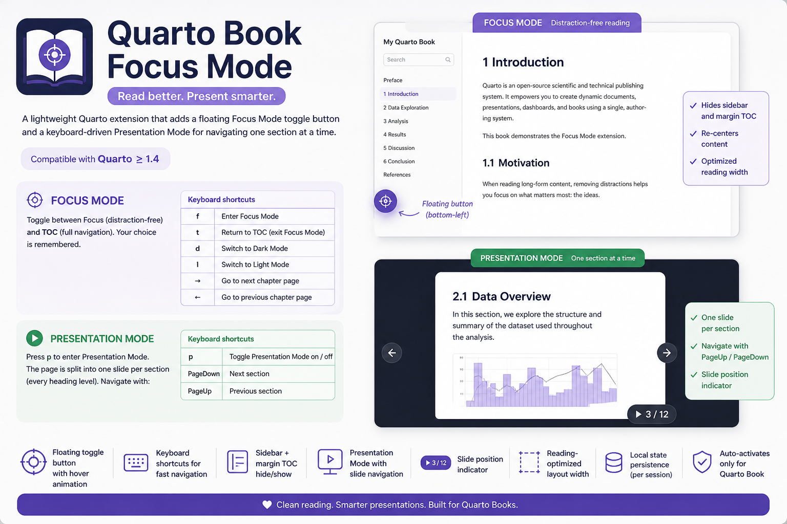

# Focus Mode

Press `f` to enter Focus Mode. The sidebar and margin TOC disappear, and the content recenters for comfortable reading.

Press `t` to bring the navigation back.

The floating button in the bottom-left corner does the same thing with a click.

This extension is desktop-only and is automatically disabled on mobile/touch devices.

If text looks too small or too large, use `Ctrl +` to zoom in and `Ctrl -` to zoom out (`Ctrl 0` resets the zoom level).



## How it works

Focus Mode adds the class `book-focus-mode` to `<body>`. The sidebar (`#quarto-sidebar`) and margin TOC (`#quarto-margin-sidebar`) are hidden with CSS, and the main content column is recentered.

The selected state is saved in `localStorage`, so it persists as you navigate between chapters.

## Custom content width

You can control the reading width by setting a CSS variable in your project stylesheet:

```css
:root {
  --book-focus-content-width: 960px;
}
```

## Dark and light theme

If your book is configured with a dark theme (e.g. `theme: [flatly, darkly]`), you can switch between schemes with:

- `d` — Dark Mode
- `l` — Light Mode

## Chapter navigation

To move to the previous or next chapter, use `←` and `→`.